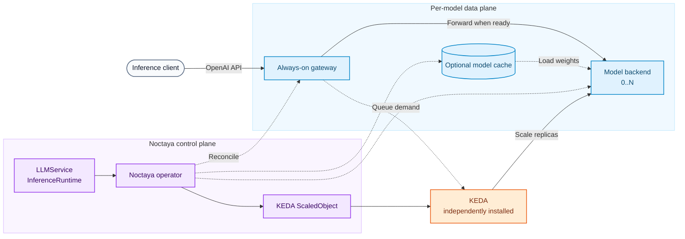

<div align="center">

# 🔥 Noctaya

**A minimal, composable LLM serving control plane for private Kubernetes clusters.**

Declarative, scale-to-zero LLM serving across heterogeneous accelerators.

[](LICENSE)
[](go.mod)
[](https://github.com/noctaya/noctaya/releases)
[](https://github.com/noctaya/noctaya/actions/workflows/test.yml)
[](ROADMAP.md)

</div>

## Overview

Noctaya is a minimal Kubernetes control plane for serving bursty or long-tail LLM workloads without reserving accelerators while they are idle. A lightweight gateway remains available for each model while KEDA scales the model backend from zero to the replica count required by current demand. The
gateway exposes an OpenAI-compatible endpoint and handles cold-start waiting, admission, and graceful draining.

Application owners declare a namespaced `LLMService` with the model source, runtime selection, accelerator resources, cache strategy, scaling policy, and endpoint behavior. Cluster administrators publish reusable, cluster-scoped `InferenceRuntime` profiles that define the serving image, device-plugin resource, scheduling constraints, health probes, and lifecycle settings. This
separates portable serving intent from cluster- and vendor-specific configuration.

From those two resources, Noctaya reconciles the backend and gateway workloads, Services, optional model cache and prewarm Job, and KEDA autoscaling resources. Noctaya runs existing inference engines such as vLLM and integrates with device plugins and schedulers; it does not implement
inference kernels, accelerator runtimes, or fleet-level serving behavior.

## Architecture

An `LLMService` consumes a reusable `InferenceRuntime`. The Noctaya operator reconciles the gateway, model backend, cache, and KEDA scaling resource, while KEDA remains independently installed and owns the backend replica count.



See the [architecture guide](docs/architecture.md) for the complete reconciliation and scale-to-zero lifecycle.

## Demo

https://github.com/user-attachments/assets/bd55e9a5-c1ce-4b06-9e82-af7a627c53b8

## Why Noctaya

- **Scale-to-zero is the center of gravity.** An always-on gateway holds or rejects cold requests while KEDA activates the model backend; idle models consume no accelerators.
- **One workload API, reusable runtime profiles.** Application owners describe the model and scaling intent. Cluster administrators define images, device resources, scheduling, and probes.
- **Thin vendor integration.** Most hardware differences are declarative runtime data; small NVIDIA and Ascend adapters translate the remaining Kubernetes-specific behavior.
- **Dependencies remain independently managed.** KEDA is required for the scaling lifecycle but is installed separately. Prometheus and Grafana remain independent, opt-in integrations.

| Layer | Owner | Noctaya's role |
|---|---|---|
| Inference engine | vLLM and vLLM-Ascend | Runs it; does not implement kernels or inference engines. |
| Accelerator discovery and scheduling | Vendor device plugins and optional Kubernetes schedulers | Consumes advertised resources and runtime scheduling configuration. |
| Fleet routing and datacenter-scale serving | Kthena, AIBrix, KServe, llm-d, and similar platforms | Stays outside this scope; Noctaya can coexist as a smaller scale-to-zero control plane. |
| Model lifecycle and scale-to-zero | Noctaya | Reconciles serving workloads, caching, gateways, and KEDA autoscaling. |

### Coexisting with serving platforms

Noctaya can share a Kubernetes cluster with broader AI serving platforms when each controller owns separate model workloads and shared infrastructure remains independently managed. Device plugins, schedulers, storage, ingress, and monitoring can be shared, but two controllers should never own
the same Deployment or model endpoint.

For example, [Kthena](https://github.com/volcano-sh/kthena) can manage continuously active, fleet-scale workloads while Noctaya manages bursty or long-tail models that should scale to zero.

## Quick Start

### Prerequisites

Before deploying a model, prepare:

- Kubernetes >= 1.30;
- Helm >= 3.0;
- a compatible accelerator driver and device plugin;
- sufficient model storage and access to the selected image registry and model source.

### Install with Helm

Install Noctaya from the checked-out Helm chart:

```bash
git clone https://github.com/noctaya/noctaya.git
cd noctaya

helm install noctaya ./charts/noctaya --namespace noctaya-system --create-namespace
```

Verify the operator and CRDs:

```bash
kubectl rollout status deployment/noctaya-controller-manager -n noctaya-system
kubectl get crd inferenceruntimes.serving.noctaya.io llmservices.serving.noctaya.io
```

See [Getting started](docs/getting-started.md). To run the same lifecycle without an accelerator,
use the [no-GPU development guide](docs/no-gpu.md).

## Contributing

Contributions, bug reports, and hardware-validation results are welcome. Start with [CONTRIBUTING.md](CONTRIBUTING.md), follow the [Code of Conduct](CODE_OF_CONDUCT.md), and report security issues through [SECURITY.md](SECURITY.md).

## License

Licensed under the [Apache License 2.0](LICENSE).
