<div align="center">

# 🔥 Noctaya

**A Kubernetes-native control plane for long-tail LLM serving across heterogeneous accelerators**

[](LICENSE)
[](go.mod)
[](https://github.com/noctaya/noctaya/releases)
[](https://github.com/noctaya/noctaya/actions/workflows/test.yml)
[](ROADMAP.md)

</div>

## Overview

Noctaya lets private Kubernetes clusters serve long-tail LLMs without reserving accelerators for idle models. A lightweight OpenAI-compatible gateway remains available while independently installed KEDA scales each backend through `0 → 1 → N → 0`. Noctaya controls cold-start admission,readiness-aware routing, caching, and graceful drain.

Application teams declare models and serving policies with `LLMService`. Cluster administrators publish reusable `InferenceRuntime` profiles for runtime images, accelerator resources, scheduling, and health. Noctaya manages this lifecycle while inference engines, device plugins, schedulers, storage, and monitoring remain independently managed.

## Architecture



Refer to the [architecture guide](docs/architecture.md).

## Demo

https://github.com/user-attachments/assets/bd55e9a5-c1ce-4b06-9e82-af7a627c53b8

## Why Noctaya

- **Built for long-tail demand.** KEDA scales each model backend through `0→1→N→0`; an idle backend consumes no accelerator.
- **Cold starts are controlled.** Bounded admission, activation leases, readiness-aware forwarding, and graceful drain protect the gateway and in-flight requests throughout the lifecycle.
- **Portable intent, device-specific execution.** Application owners describe the model and scaling policy once, while reusable `InferenceRuntime` profiles capture NVIDIA, Ascend, and future accelerator details.
- **Composable by design.** KEDA, device plugins, schedulers, storage, and monitoring remain independently installed and managed.

| Layer | Owner | Noctaya's role |
|---|---|---|
| Inference engine | vLLM and vLLM-Ascend | Runs it; does not implement kernels or inference engines. |
| Accelerator discovery and scheduling | Vendor device plugins and optional Kubernetes schedulers | Consumes advertised resources and runtime scheduling configuration. |
| Broader serving and fleet management | Kthena, AIBrix, KServe, llm-d, and similar platforms | Does not reproduce platform-wide routing or advanced serving patterns; coexists on separately owned workloads. |
| Model lifecycle and scale-to-zero | Noctaya | Reconciles serving workloads, caching, gateways, and KEDA autoscaling. |

### Coexisting with serving platforms

Noctaya can share a Kubernetes cluster with broader AI serving platforms when each controller owns separate model workloads and shared infrastructure remains independently managed. Device plugins, schedulers, storage, ingress, and monitoring can be shared, but two controllers should never own
the same Deployment or model endpoint.

For example, a cluster operator may use
[Kthena](https://github.com/volcano-sh/kthena) for continuously active or fleet-level workloads while assigning separate bursty or long-tail endpoints that should scale to zero to Noctaya.

## Quick Start

### Prerequisites

Before deploying a model, prepare:

- Kubernetes >= 1.30;
- Helm >= 3.0;
- a compatible accelerator driver and device plugin;
- sufficient model storage and access to the selected image registry and model source.

### Install with Helm

Install Noctaya from the checked-out Helm chart:

```bash
git clone https://github.com/noctaya/noctaya.git
cd noctaya

helm install noctaya ./charts/noctaya --namespace noctaya-system --create-namespace
```

Verify the operator and CRDs:

```bash
kubectl rollout status deployment/noctaya-controller-manager -n noctaya-system
kubectl get crd inferenceruntimes.serving.noctaya.io llmservices.serving.noctaya.io
```

See [Getting started](docs/getting-started.md). To run the same lifecycle without an accelerator,
use the [no-GPU development guide](docs/no-gpu.md).

## Contributing

Refer to [CONTRIBUTING.md](CONTRIBUTING.md)

## License

Licensed under the [Apache License 2.0](LICENSE).
