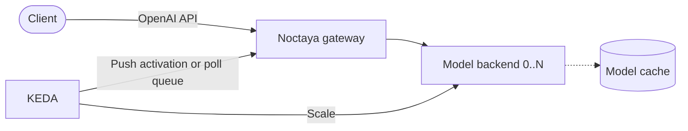

<div align="center">

# 🔥 Noctaya

**A minimal, composable LLM serving control plane for private Kubernetes clusters.**

Declarative, scale-to-zero LLM serving across heterogeneous accelerators.

[](LICENSE)
[](go.mod)
[](https://github.com/noctaya/noctaya/releases)
[](https://github.com/noctaya/noctaya/actions/workflows/test.yml)
[](ROADMAP.md)

</div>

## Overview

Noctaya is a minimal Kubernetes control plane for serving bursty or long-tail LLM workloads without
reserving accelerators while they are idle. A lightweight gateway remains available for each model
while KEDA scales the model backend from zero to the replica count required by current demand. The
gateway exposes an OpenAI-compatible endpoint and handles cold-start waiting, admission, and
graceful draining.

Application owners declare a namespaced `LLMService` with the model source, runtime selection,
accelerator resources, cache strategy, scaling policy, and endpoint behavior. Cluster
administrators publish reusable, cluster-scoped `InferenceRuntime` profiles that define the serving
image, device-plugin resource, scheduling constraints, health probes, and lifecycle settings. This
separates portable serving intent from cluster- and vendor-specific configuration.

From those two resources, Noctaya reconciles the backend and gateway workloads, Services, optional
model cache and prewarm Job, and KEDA autoscaling resources when KEDA is installed. Noctaya runs
existing inference engines such as vLLM and integrates with device plugins and schedulers; it does
not implement inference kernels, accelerator runtimes, or fleet-level serving behavior.

## Demo

https://github.com/user-attachments/assets/2d217dad-0280-4509-8793-dfd13ce0cdfa

The [operational walkthrough](docs/demo.md) shows Kthena keeping a hot model ready while a request
activates a Noctaya-managed long-tail model from zero and lets it return to zero afterward.

## Why Noctaya

- **Scale-to-zero is the center of gravity.** An always-on gateway holds or rejects cold requests
  while KEDA activates the model backend; idle models consume no accelerators.
- **One workload API, reusable runtime profiles.** Application owners describe the model and
  scaling intent. Cluster administrators define images, device resources, scheduling, and probes.
- **Thin vendor integration.** Most hardware differences are declarative runtime data; small
  NVIDIA and Ascend adapters translate the remaining Kubernetes-specific behavior.
- **Optional integrations stay optional.** KEDA is required for autoscaling and scale-to-zero, but
  basic reconciliation continues without it. Prometheus and Grafana are independent, opt-in
  integrations.

| Layer | Owner | Noctaya's role |
|---|---|---|
| Inference engine | vLLM and vLLM-Ascend | Runs it; does not implement kernels or inference engines. |
| Accelerator discovery and scheduling | Vendor device plugins and optional Kubernetes schedulers | Consumes advertised resources and runtime scheduling configuration. |
| Fleet routing and datacenter-scale serving | Kthena, AIBrix, KServe, llm-d, and similar platforms | Stays outside this scope; Noctaya can coexist as a smaller scale-to-zero control plane. |
| Model lifecycle and scale-to-zero | Noctaya | Reconciles serving workloads, caching, gateways, and KEDA autoscaling. |

### Noctaya and Kthena

[Kthena](https://github.com/volcano-sh/kthena), a [Volcano](https://volcano.sh/) sub-project, is a
Kubernetes-native AI serving **platform**: multi-model routing, KV-cache-aware scheduling,
prefill/decode disaggregation, and fleet-scale autoscaling, with first-class NPU support. If you run
a serious multi-model serving estate, **use Kthena — it's excellent.** Noctaya lives at the other end
of the same axis: a handful of occasionally-used models on a handful of cards, where you want the
smallest possible footprint — one manifest, KEDA, done. The two compose naturally on one cluster:
**hot, high-traffic models on Kthena; the long tail scaled to zero with Noctaya**, on the same
(Volcano-schedulable) silicon.

## Quick Start

### Prerequisites

Before installing Noctaya, prepare:

- Kubernetes >= 1.30;
- Helm > 3;
- a compatible accelerator driver and device plugin; and
- sufficient model storage and access to the selected image registry and model source.

### Install with Helm

Install KEDA first by following its official [deployment guide](https://keda.sh/docs/2.20/deploy/)
when autoscaling or scale-to-zero is required. Then install the Noctaya prerelease:

```bash
NOCTAYA_VERSION=0.4.0-alpha.1

helm upgrade --install noctaya \
  "https://github.com/noctaya/noctaya/releases/download/v${NOCTAYA_VERSION}/noctaya-${NOCTAYA_VERSION}.tgz" \
  --namespace noctaya-system \
  --create-namespace
```

Verify the operator and CRDs:

```bash
kubectl rollout status deployment/noctaya-controller-manager -n noctaya-system
kubectl get crd inferenceruntimes.serving.noctaya.io llmservices.serving.noctaya.io
```

### Deploy an example

```bash
NOCTAYA_VERSION=0.4.0-alpha.1

kubectl create namespace ai --dry-run=client -o yaml | kubectl apply -f -
kubectl apply -n ai -k \
  "https://github.com/noctaya/noctaya//examples/nvidia/a10?ref=v${NOCTAYA_VERSION}"

kubectl get inferenceruntime vllm-nvidia-a10
kubectl get llmservice,deployment,pod,service,pvc,job,scaledobject -n ai -w
```

The profile installs a cluster-scoped runtime and a namespaced `LLMService`. Its prewarm Job first
downloads the model; the first request then activates the backend from zero. See [LLMService walkthrough](docs/started.md#understand-the-llmservice)

For other devices, select a profile from [`examples/`](examples). To exercise the full lifecycle
without an accelerator, use the [no-GPU development guide](docs/no-gpu.md).

## Architecture

One `LLMService` consumes one cluster-scoped `InferenceRuntime` and reconciles to a backend
Deployment and Service, a gateway Deployment and Service, optional cache and prewarm resources,
and a KEDA `ScaledObject` when KEDA is installed.



The gateway exposes the demand signal, buffers requests during cold start, and forwards them once
the model is ready. KEDA polling is the compatibility default; an opt-in ExternalScaler removes the
poll interval from cold activation. See the [architecture guide](docs/architecture.md) for the full
data flow and gateway-replica constraint.

## Contributing

Contributions, bug reports, and hardware-validation results are welcome. Start with
[CONTRIBUTING.md](CONTRIBUTING.md), follow the [Code of Conduct](CODE_OF_CONDUCT.md), and report
security issues through [SECURITY.md](SECURITY.md).

## License

Licensed under the [Apache License 2.0](LICENSE).
