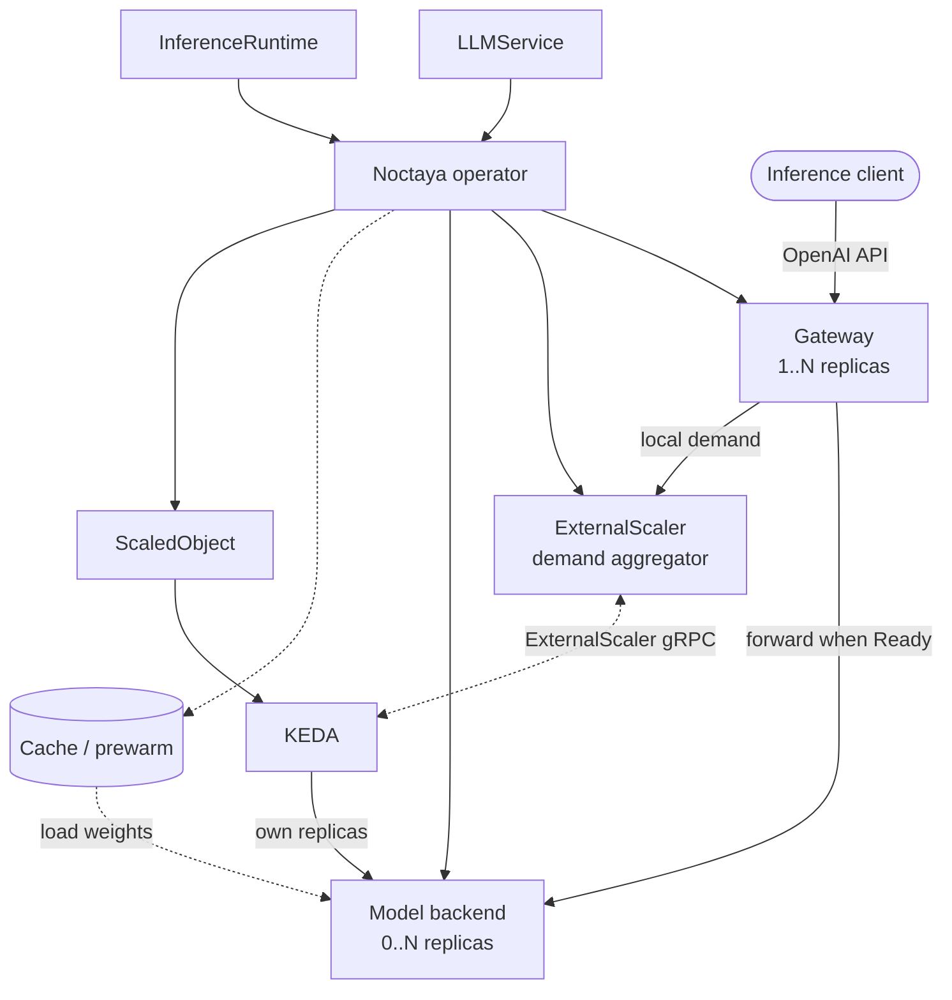

# Architecture

Noctaya is a composable Kubernetes control plane for running model servers that can release accelerators when idle and recover safely on the next request.

## Problem

Scaling a model backend to zero saves accelerator capacity, but makes the next request a multi-stage cold start: Kubernetes must schedule a Pod, pull its image, make model weights available, load the model, and pass readiness checks. Each stage has a different latency tail.
During that time there is no ready backend, and an unbounded request queue can overload the gateway before the model starts.

Model definitions also become difficult to reuse when container arguments, device resources, scheduler settings, and vendor-specific behavior are embedded in every workload.

Noctaya solves these problems by:

- keeping a lightweight, stable gateway available while the model backend is at zero;
- bounding cold-request admission and preserving demand until activation succeeds or times out;
- using KEDA to own backend replica scaling from `0..N`;
- separating model intent (`LLMService`) from reusable runtime and accelerator details (`InferenceRuntime`);
- coordinating cache prewarming, model-aware readiness, and graceful drain.

Noctaya makes cold starts controlled and observable; it does not make model loading instantaneous.

## Boundary

| Noctaya owns | Installed and managed separately |
|---|---|
| Workload rendering, runtime selection, model cache/prewarm, health, drain, gateway admission, scaling intent, and status | Inference engines and vendor plugins, accelerator drivers and device plugins, KEDA, schedulers such as Volcano or HAMi, and monitoring stacks |

Inference kernels, fleet routing, prefill/decode disaggregation, and multi-cluster scheduling are outside Noctaya's scope.
It can coexist with higher-level platforms such as Kthena, AIBrix, KServe, and llm-d; see [Noctaya and Kthena](https://noctaya.io/#noctaya-and-kthena).
Accelerator integrations remain thin Kubernetes translations rather than vendor runtime implementations.

## API model

The API group is `serving.noctaya.io/v1alpha1`.

| Resource | Scope | Purpose |
|---|---|---|
| `LLMService` | Namespaced | Declares the model, runtime selection, resources, scaling, cache, and endpoint behavior |
| `InferenceRuntime` | Cluster | Defines a reusable runtime image and arguments, accelerator resource, scheduling, probes, lifecycle, and optional metric metadata |

`InferenceRuntime` is configuration, not a workload. Its controller is passive; the `LLMService` reconciler selects and consumes it.

## Design

| Component | Responsibility |
|---|---|
| Operator (`internal/controller/llmservice`) | Selects a runtime and reconciles the per-model Kubernetes resources |
| Runtime layer (`internal/backend/runtime`) | Renders vendor-neutral runtime pods; thin adapters translate accelerator details |
| Resource layer (`internal/backend/resources`) | Builds owned Deployments, Services, autoscaling, cache, prewarm, and gateway objects |
| Gateway (`internal/gateway/proxy`) | Provides the stable OpenAI-compatible endpoint, bounded admission, readiness-aware proxying, drain, and local demand |
| Aggregate scaler (`internal/gateway/scaler`) | Combines demand from multiple gateways and exposes one KEDA ExternalScaler endpoint |
| KEDA | Reads demand and owns backend replicas; it is required for `LLMService` scaling but installed independently |

Each `LLMService` produces a backend Deployment and Service, a gateway Deployment and public Service, an internal scaler Service, a KEDA `ScaledObject`, and—when requested—cache and prewarm resources. Multiple gateways also receive preferred hostname anti-affinity, a `minAvailable: 1` PodDisruptionBudget, one aggregate-scaler Deployment, and an internal authentication Secret. The operator deliberately omits backend `replicas`; KEDA owns that field.

The installation defaults to two leader-elected operator replicas. Preferred hostname anti-affinity spreads them when topology permits, and a `minAvailable: 1` PodDisruptionBudget protects voluntary disruption. Exactly one replica holds the namespaced Lease and reconciles; healthy standbys take over when leadership is released or expires. A deliberate single-replica installation remains supported.

## Request lifecycle

1. **Idle:** with `spec.scaling.min: 0`, the gateway remains available while KEDA holds the backend at `0`.
2. **Authenticate:** when configured, the gateway validates the client Bearer token before it consumes queue capacity.
3. **Admit:** a cold request occupies one bounded queue slot. A full queue returns `429`. `keepalive` holds the request with SSE heartbeats; `reject` returns `503` with `Retry-After`.
4. **Activate:** KEDA observes demand and scales the backend from `0` to `1`. The Pod is not Ready until scheduling, image pull, weight loading, and runtime probes complete.
5. **Serve:** the gateway forwards the request only after the backend is Ready.
6. **Scale out:** sustained queue depth can increase replicas up to `spec.scaling.max`.
7. **Scale down:** after demand and the stabilization window expire, KEDA returns the backend toward `0`; `preStop` drain protects in-flight requests.

## Scaling and failure behavior

Noctaya and KEDA are installed independently. The operator may start before KEDA, but the KEDA `ScaledObject` CRD must exist before an `LLMService` is deployed. Otherwise reconciliation reports `AutoscalingReady=False` and does not create the model backend.

Noctaya uses KEDA External Push. `StreamIsActive` sends the initial `0→1` activation without waiting for a polling interval. KEDA still reads `IsActive` and `GetMetrics` periodically for recovery and metric-based `1→N` scale-out. `/noctaya/queue` remains a diagnostic view of one gateway's effective demand; KEDA does not consume it.

With one gateway replica, the ExternalScaler remains co-located in that gateway. With multiple replicas, the operator creates one lightweight aggregate-scaler Deployment and a per-service authentication Secret. Each gateway publishes its complete demand on transitions and every two seconds. Reports carry the Secret token, a process-unique identity, and an increasing sequence number. The scaler bounds report concurrency, member count, and per-member demand before summing the newest report from each member.

`spec.endpoint.maxQueue` bounds admission per gateway and the corresponding per-member demand report. Gateway CPU and memory can be reserved independently from backend accelerator resources through `spec.endpoint.resources`.

A graceful gateway shutdown withdraws its report. A disconnected or replaced member expires after ten seconds, which may briefly overestimate demand but cannot leave a permanent activation lease. Surviving members retain their demand, and replacement gateways register independently. The aggregator is memory-only; after it is replaced, gateway heartbeats rebuild the aggregate.

Cold admission creates an activation lease independent of the client connection. Demand remains active until the backend becomes Ready, followed by a short retry grace, or until `activationTimeout` expires. If a load fails, that lease expires instead of signaling forever; a later cold request may start a new lease.

The controller watches the backend Deployment and Pods. `LLMService` conditions distinguish ordinary startup and scheduling delay from image-pull failures, repeated termination, OOM, crash loops, and a Deployment progress deadline. These observations do not change the gateway contract: the gateway has no Kubernetes credentials, does not replay requests, and returns a bounded `activation_timeout` if readiness does not arrive in time. See [Troubleshoot Noctaya](troubleshooting.md).

Client API-key authentication is optional for backward compatibility. When enabled, the gateway mounts one referenced Secret key and rereads it for every proxied request, so Secret rotation does not require an `LLMService` change or gateway restart. `/healthz`, `/metrics`, and `/noctaya/queue` remain unauthenticated for probes and monitoring and must be protected by cluster networking.

The scaler Service is cluster-internal and is not part of the public gateway Service. KEDA connects to ExternalScaler gRPC on port `9090`; plaintext is the default, and an `LLMService` can reference existing server credentials and a KEDA authentication object to require mutual TLS. Multiple gateways publish authenticated demand to the aggregate scaler over HTTP on port `9091`. Certificate issuance, rotation, and network isolation remain cluster responsibilities; [`examples/security`](https://github.com/noctaya/noctaya/tree/main/examples/security) provides opt-in configuration.

## Model delivery and caching

Caching reduces repeated download time; runtime loading time remains. Implemented strategies are `NodeLocalPVC` (default), `SharedPVC`, `HostPath`, and `None`. `SharedPVC` creates one `ReadWriteMany` claim for reuse by replicas on different nodes; the selected StorageClass must actually provide RWX semantics. `BakedImage` remains reserved.

An optional prewarm Job downloads Hugging Face or ModelScope weights without requesting an accelerator. With a prewarmed `SharedPVC`, the Job is the only writer and serving containers mount the completed cache read-only. A readiness marker prevents backends from consuming partial output. Without prewarm, serving containers retain the write access required by hub clients. A `pvc://` source mounts pre-staged weights read-only and skips prewarming.

Digest-pinned `oci://` sources always stage through a one-time Job. A pinned ORAS container pulls artifact files into an isolated `emptyDir`; a second container rejects symbolic links, copies to a partial directory on the cache filesystem, atomically promotes the directory, and writes the readiness marker. Registry credentials are projected from a `kubernetes.io/dockerconfigjson` Secret and never enter status, logs, or arguments. Cancellation and retry can leave only an untrusted `.partial` directory, which the next attempt removes.

Cache PVCs and prewarm Jobs are create-once because their workload fields are immutable. Their desired specifications are hashed; changing model or cache configuration reports an explicit error until the old resource is deliberately replaced. Terminal Job failure is reported as `PrewarmFailed`.

## Observability

The backend and gateway expose `/metrics` through Services with a stable `http` port and the `serving.noctaya.io/llmservice` discovery label. Noctaya does not manage a monitoring stack.
[`examples/observability`](https://github.com/noctaya/noctaya/tree/main/examples/observability) provides an optional `ServiceMonitor`, alert examples, and Grafana dashboard.
