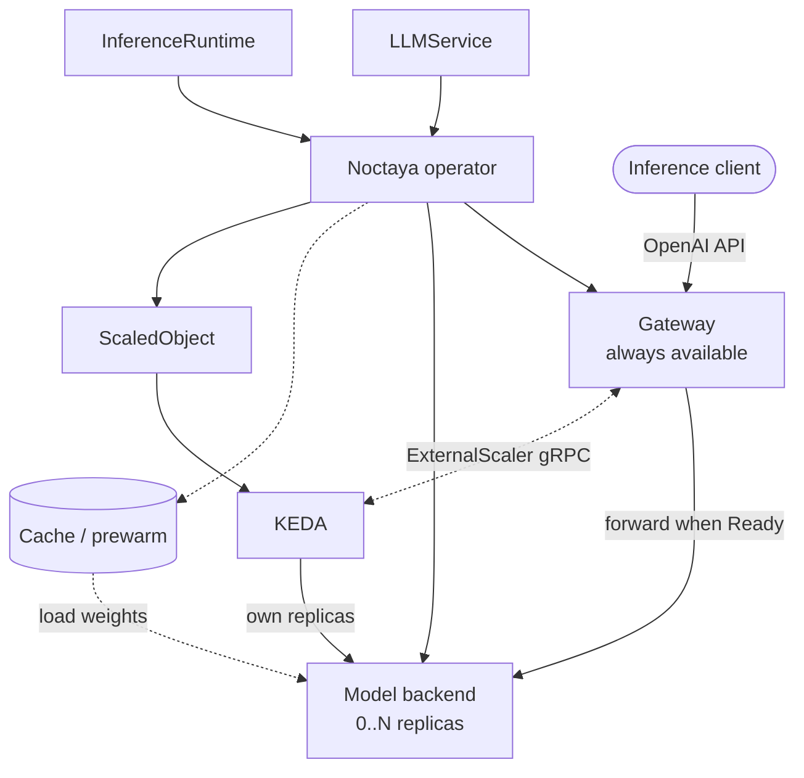

# Architecture

Noctaya is a composable Kubernetes control plane for running model servers that can release accelerators when idle and recover safely on the next request.

## Problem

Scaling a model backend to zero saves accelerator capacity, but makes the next request a multi-stage cold start: Kubernetes must schedule a Pod, pull its image, make model weights available, load the model, and pass readiness checks. Each stage has a different latency tail.
During that time there is no ready backend, and an unbounded request queue can overload the gateway before the model starts.

Model definitions also become difficult to reuse when container arguments, device resources, scheduler settings, and vendor-specific behavior are embedded in every workload.

Noctaya solves these problems by:

- keeping a lightweight, stable gateway available while the model backend is at zero;
- bounding cold-request admission and preserving demand until activation succeeds or times out;
- using KEDA to own backend replica scaling from `0..N`;
- separating model intent (`LLMService`) from reusable runtime and accelerator details (`InferenceRuntime`);
- coordinating cache prewarming, model-aware readiness, and graceful drain.

Noctaya makes cold starts controlled and observable; it does not make model loading instantaneous.

## Boundary

| Noctaya owns | Installed and managed separately |
|---|---|
| Workload rendering, runtime selection, model cache/prewarm, health, drain, gateway admission, scaling intent, and status | Inference engines and vendor plugins, accelerator drivers and device plugins, KEDA, schedulers such as Volcano or HAMi, and monitoring stacks |

Inference kernels, fleet routing, prefill/decode disaggregation, and multi-cluster scheduling are outside Noctaya's scope.
It can coexist with higher-level platforms such as Kthena, AIBrix, KServe, and llm-d; see [Noctaya and Kthena](https://noctaya.io/#noctaya-and-kthena).
Accelerator integrations remain thin Kubernetes translations rather than vendor runtime implementations.

## API model

The API group is `serving.noctaya.io/v1alpha1`.

| Resource | Scope | Purpose |
|---|---|---|
| `LLMService` | Namespaced | Declares the model, runtime selection, resources, scaling, cache, and endpoint behavior |
| `InferenceRuntime` | Cluster | Defines a reusable runtime image and arguments, accelerator resource, scheduling, probes, lifecycle, and optional metric metadata |

`InferenceRuntime` is configuration, not a workload. Its controller is passive; the `LLMService` reconciler selects and consumes it.

## Design

| Component | Responsibility |
|---|---|
| Operator (`internal/controller`) | Selects a runtime and reconciles the per-model Kubernetes resources |
| Backend layer (`internal/backend`) | Renders common vLLM resources; thin adapters translate NVIDIA or Ascend details |
| Gateway (`internal/gateway`) | Provides the stable OpenAI-compatible endpoint, bounded admission, readiness-aware proxying, drain, demand metrics, and KEDA ExternalScaler |
| KEDA | Reads demand and owns backend replicas; it is required for `LLMService` scaling but installed independently |

Each `LLMService` produces a backend Deployment and Service, a gateway Deployment and public Service, an internal scaler Service, a KEDA `ScaledObject`, and—when requested—cache and prewarm resources. The operator deliberately omits backend `replicas`; KEDA owns that field.

## Request lifecycle

1. **Idle:** with `spec.scaling.min: 0`, the gateway remains available while KEDA holds the backend at `0`.
2. **Admit:** a cold request occupies one bounded queue slot. A full queue returns `429`. `keepalive` holds the request with SSE heartbeats; `reject` returns `503` with `Retry-After`.
3. **Activate:** KEDA observes demand and scales the backend from `0` to `1`. The Pod is not Ready until scheduling, image pull, weight loading, and runtime probes complete.
4. **Serve:** the gateway forwards the request only after the backend is Ready.
5. **Scale out:** sustained queue depth can increase replicas up to `spec.scaling.max`.
6. **Scale down:** after demand and the stabilization window expire, KEDA returns the backend toward `0`; `preStop` drain protects in-flight requests.

## Scaling and failure behavior

Noctaya and KEDA are installed independently. The operator may start before KEDA, but the KEDA `ScaledObject` CRD must exist before an `LLMService` is deployed. Otherwise reconciliation reports `AutoscalingReady=False` and does not create the model backend.

Noctaya uses KEDA External Push. `StreamIsActive` sends the initial `0→1` activation without waiting for a polling interval. KEDA still reads `IsActive` and `GetMetrics` periodically for recovery and metric-based `1→N` scale-out. `/noctaya/queue` remains a diagnostic view of effective demand; KEDA does not consume it.

Exactly one gateway replica is supported because demand is not yet aggregated across gateway Pods. The operator and Helm chart reject any other replica count.

Cold admission creates an activation lease independent of the client connection. Demand remains active until the backend becomes Ready, followed by a short retry grace, or until `activationTimeout` expires. If a load fails, that lease expires instead of signaling forever; a later cold request may start a new lease.

The scaler Service is cluster-internal, uses plaintext gRPC on port `9090`, and is not part of the public gateway Service. Use a NetworkPolicy when tenant isolation requires it.

## Caching

Caching reduces repeated download time; runtime loading time remains. Implemented strategies are `NodeLocalPVC` (default), `HostPath`, and `None`. The API reserves `SharedPVC` and `BakedImage`, but they are not implemented.

An optional prewarm Job downloads Hugging Face or ModelScope weights without requesting an accelerator. A `pvc://` model source mounts pre-staged weights read-only and skips prewarming.
Cache PVCs and prewarm Jobs are create-once because their workload fields are immutable; replace them explicitly after changing model or cache configuration.

## Observability

The backend and gateway expose `/metrics` through Services with a stable `http` port and the `serving.noctaya.io/llmservice` discovery label. Noctaya does not manage a monitoring stack.
[`examples/observability`](https://github.com/noctaya/noctaya/tree/main/examples/observability) provides an optional `ServiceMonitor` and Grafana dashboard.
